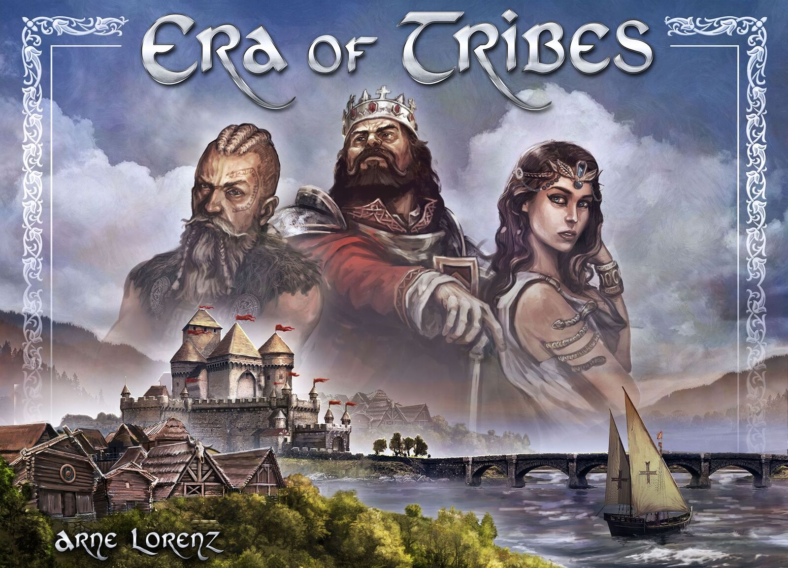

Era of Tribes v1.4 - Official Tabletop Simulator Mod
======================================================

Era of Tribes is a civilization worker-placement strategy game by Arne Lorenz.
It plays 1-6 players from 14 years+. Your goal is to develop, expand, discover,
and interact with your fellow players in Europe from the Neolithic period to
the High Middle Ages.

* [Era of Tribes BoardGameGeek Page][1]
* [Era of Tribes Facebook Page][2]
* [Era of Tribes Tabletop Simulator Workshop Page][3]

The rulebook is available for download at the BoardGameGeek page, or is also
made available in the TTS mod.

Installation
------------------------------

This mod is distributed through a [Steam Workshop page][3]. The easiest way to
install this mode is to go to the Workshop page and click the "Subscribe"
button.

Credits
------------------------------

Huge thanks to Arne Lorenz for not only creating a fantastic civ game, but also
for giving permission to create this mod and providing high quality asset
images!

This Tabletop Simulator mod was adapted from the original Era of Tribes Scripted
mod based on Arne's prototype:

https://steamcommunity.com/sharedfiles/filedetails/?id=1701980551

Most of the credit for this mod goes to Kijan's original work developing that
mod. This original version is archived in the repo and tagged as v0.1.0.

Hazelrah started with Kijan's mod and used Arne's updated assets to update the
mod to the published version.

Making Contributions
------------------------------

If you are interested in helping with the development of the Era of Tribes
Tabletop Simulator mod, then see [the wiki on GitHub][4].

Also, have a look at the [list of issues on GitHub][5]

Contents of this Repository
------------------------------

Tabletop Simulator strives to maintain just single file mods, so the mod file
itself is quite dense. This leads to just a handful of files that need to be
checked into the repository.

* `EoT_TTS.json` - The main Tabletop Simulator mod file. This can be copied
  over a save file and then you can play the latest version of the Era of
  Tribes mod!
* `EoT_Cover.jpeg` - The beautiful cover of this board game! Isn't it lovely!
* `EoT_Cover.png` - The older cover of the prototype. We keep it around four
  sentimental reasons.
* `README.md` - This file that your reading right now.
* `reference/` - Individual files which are extraced from `EoT_TTS.json` for
  easy reading and easy auditing of the history. See the next section for
  details.
    * `Chooser.af9065.ttslua` - Lua script for an old version of the Tribes
      Chooser board. (may delete one of these days)
    * `Chooser.af9065.xml` - UI definition file for an old version of the
      Tribes Chooser board. (may delete one of these days).
    * `Chooser.b2a4d0.ttslua` - Lua script for the current version of the
      Tribes Chooser board. This copy is locked under the table.
    * `Chooser.af9065.xml` - UI definition file for the current version of the
      Tribes Chooser board. This copy is locked under the table.
    * `Flex Table Control.bd969bd.ttslua` - Lua script for the Flex Table
      controller hidden under the table.
    * `Game Setup Button.8b17c5.ttslua` - Lua script for the "Game Setup"
      button at the top of the table.
    * `Global.-1.ttslua` - The global Lua script. Most of the script code is
      contained in this file. Buttons and the like call into functions defined
      here.
    * `Global.-1.xml` - Common UI description file, containing code for the
      "Game Setup" and the "Preview Nations"
    * `Preview Nations.329cad.ttslua` - Lua script file for the
      "Preview Nations" button at the top of the screen.

### Reference files

Files in the `/reference` directory are those `ttslua` and `xml` files exported
to the Atom text editor. The contents is entirely contained within the base
`EoT_TTS.json` file, but it is easier to look at the diffs when they are in
individual files.

Copywrite Notice
------------------------------

The original Era of Tribes board game is Copywrite © 2019

Black Beacon Games and Arne Lorenz
Deichstraße 32, 27809 Lemwerder
arnelorenz@gmx.de

The images and game rules taken from the Era of Tribes board game referenced by
this Tabletop Simulator mod are reproduced with permission by Arne Lorenz.

The other content and 3D models are original artwork made specially for this
mod by contributors.

The authors of this mod make no claim to the intelectual property of the Era of
Tribes board game.

If you want to support the creator of the game then please buy it! Arne lists
available copies on the BoardGameGeek website.

[1]: https://boardgamegeek.com/boardgame/196354/era-tribes
[2]: https://www.facebook.com/eraoftribes/
[3]: https://steamcommunity.com/sharedfiles/filedetails/?id=1701980551
[4]: https://github.com/HazelrahBL/EraOfTribesTTS/wiki
[5]: https://github.com/HazelrahBL/EraOfTribesTTS/issues
